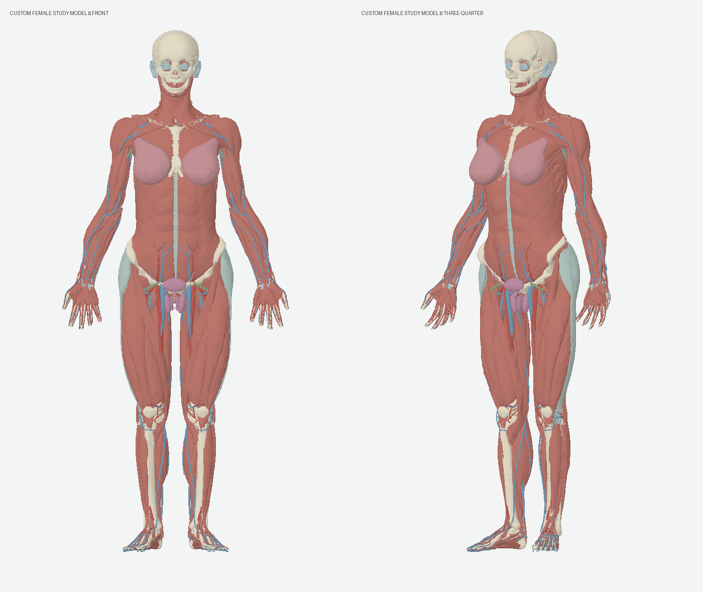

# Female Anatomy Blast

**[Open the live demo](https://female-anatomy-blast.vercel.app/)** — free to explore, no sign-in required.

An open-source, interactive anatomy explorer by **Mercy Thaddeus**. Rotate the body, explore 15 systems, search for a structure, isolate it, or separate every piece in an exploded view.

Built with AI assistance and inspired by [Human Atlas by ashemag](https://github.com/ashemag/human-atlas). This project combines open anatomy datasets with explicitly labelled teaching schematics to make female anatomy easier to explore and improve together.

**Educational prototype.** This is a composite illustration, not a scan of a woman or a clinically validated atlas. Shared anatomy is adapted from a male reference. Shapes, attachments and registration between sources need specialist review.



The latest refinement adds localized torso and shoulder shaping, posterior muscle contours and a coherent fit for all breast tissues. See the [before/after review and measured changes](docs/REFINEMENT.md). These are illustration choices, not a standard female body shape.

## Explore

- **2,353 selectable pieces** and 3,563 searchable groups.
- Female reference pelvis, breasts, internal reproductive organs, bladder and uterine arteries.
- Labelled schematic additions for the vulva, pelvic nerves and vessels, perineal muscles, thyroid/parathyroids, lymphatic examples and middle-ear bones.
- A [206-bone inventory](public/bone-checklist.csv): **200 reference-based bone entries + 6 schematic ear bones**. This verifies names and presence, not anatomical accuracy. Mesh counts are not bone counts.
- Structure-level provenance, source links, layer controls, orbit/zoom, isolation and exploded layouts.

Read the [coverage and remaining gaps](public/MODEL-COVERAGE.md) before using the model to teach. A complete skin envelope, detailed terminal branches, microscopic structures and clinical validation are still missing.

## Run locally

Requires Node.js 22.13 or later and npm. No API keys or paid model downloads are needed.

```sh
git clone https://github.com/ThaddeusMercy/female-anatomy-blast.git
cd female-anatomy-blast
npm ci
npm run dev
```

Open the local URL printed by Vite (port 3017 by default). Geometry is included in `public/models/`; it does not require a separate dataset download to run.

```sh
npm run check
node scripts/validate-atlas.mjs
node --experimental-strip-types scripts/validate-interactions.mjs
python3 scripts/audit-inventory.py
npm run build
```

The static website is built into `dist/`. Deploy that directory to your static host. Keep the geometry `.gz` files intact; the viewer handles both transparently decompressed HTTP responses and raw gzip responses. `public/_headers` supplies the recommended content encoding for compatible hosts.

## How the anatomy is assembled

1. BodyParts3D meshes adapted by Human Atlas supply shared full-body anatomy. A continuous shape transformation is applied to these meshes.
2. Human Reference Atlas female v1.5 supplies 76 meshes, fitted to the illustration. Source identifiers and transformations are retained in the manifest.
3. `scripts/expand-atlas.mjs` corrects known layer errors, removes five exact duplicate meshes, adds two HRA uterine artery meshes and authors 81 new schematic pieces. Together with the existing urethra, there are 82 schematic pieces.

4. `scripts/refine-anatomy.mjs` refines the expanded model using a common localized spatial field, a shared fit for the 16 breast pieces and bounded repairs for thin source triangles. It preserves all IDs, triangle indices and provenance labels.

The included geometry is ready to run. To reproduce or modify the refinement, follow [the exact baseline and build instructions](docs/REFINEMENT.md#reproduce-the-refinement). The script requires an unrefined baseline outside the output folder and refuses refined input so repeated runs cannot compound the deformation. Expand the baseline before refining; the expansion script rejects an already refined model.

`scripts/build-custom-female.mjs` records the earlier base assembly; rebuilding that stage requires the original source catalogs and byte ranges described in its header. Those large intermediate inputs are not required to run or modify this release.

## Contribute

Anatomists, educators, 3D artists and developers are welcome. Start with [CONTRIBUTING.md](CONTRIBUTING.md). Useful contributions include reviewed anatomical corrections, replacing schematics with openly licensed reference meshes, better explanations and accessibility improvements.

Please include a source for anatomical claims, preserve provenance and distinguish an inventory check from a medical review. Do not upload patient data or assets you cannot redistribute.

## Credits and licenses

- **Application code:** MIT. Original Human Atlas copyright and license are retained.
- **BodyParts3D geometry:** © The Database Center for Life Science, CC BY 4.0, adapted.
- **HRA female geometry:** Kristen Browne and Heidi Schlehlein, 2023, CC BY 4.0, fitted and in some cases simplified.
- **New authored schematic geometry:** Mercy Thaddeus, 2026, CC BY 4.0.

See [full attribution and construction notes](public/ATTRIBUTION.md). Anatomy asset licenses are separate from the code license. Referenced medical reading informs descriptions; it is not the source of our authored mesh files.
