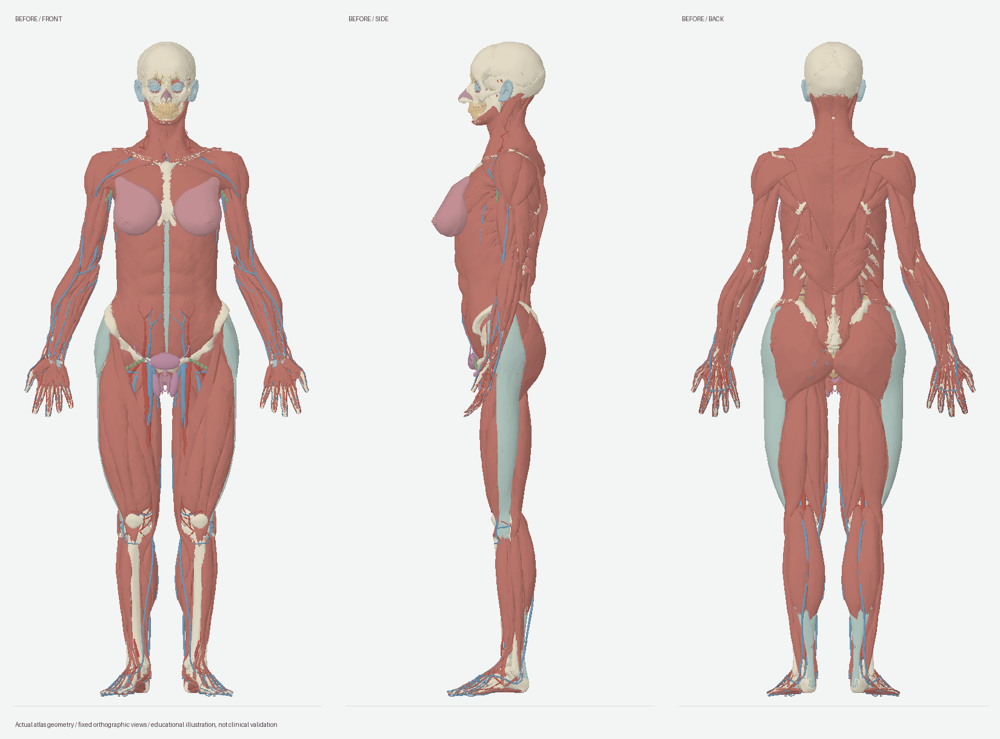

# Contour and fit refinement — September 2026

This update refines the existing Female Anatomy Blast illustration. It preserves **2,353 selectable pieces, 3,563 groups, 2,537,272 triangles and the 206-entry bone inventory**. It does not add a clinically validated female surface scan or establish a single standard female body shape.

## Actual mesh comparisons

The images below are orthographic renders of the committed geometry with identical cameras, scale, systems and lighting. They are generated offline by `scripts/render-model-review.py`, not generated anatomy artwork or website screenshots. The simple CPU renderer uses triangle depth sorting; these images are for silhouette review, not for measuring tissue contacts.

### Before: expanded 2.1 model



### After: refined 2.2 model


The visual review found a smoother waist-to-hip transition, a modestly narrower shoulder outline, less projecting breast contours and a fuller posterior muscle profile. Head, hands and lower legs retain their existing geometry. The exposed skull, open anatomy presentation and incomplete skin envelope remain intentional limitations of the available assets.

## What changed

- A continuous torso field reduces waist width locally, fading out before the outer forearms and hands. Shoulder width and thorax depth receive smaller adjustments.
- A compact posterior field modifies the gluteal region and surrounding surfaces together. Because the same spatial field applies across systems, coincident input vertices stay coincident. This includes small changes to some female reference pelvic surfaces; it is not a validated change to pelvic morphology.
- All 16 breast pieces use one additional spatial field within each breast. Small side-specific depth translations reduce the sampled posterior overlap with the pectoral surface; a smooth anterior adjustment reduces projection and gently lifts the lower anterior region. Lobes, ducts, fat, suspensory ligaments, areolae and nipples are not moved independently.
- The core uterus, ovaries, vagina and schematic urethra keep exactly the same vertex positions. Their surrounding anatomical connections remain unvalidated.
- The smooth field is applied to positions and inverse-transpose normals. A preflight identified 13 thin source triangles that under-resolved the curvature. Tangent-affine repairs affected 39 unique source coordinates by at most **0.612 mm** beyond the smooth field. Those corrections are shared by coincident vertices, and their normals are recomputed from final faces. No vertices or triangle indices are added or removed.
- Model bounds are rebuilt for selection, camera fitting and exploded layouts. Geometry URLs include content hashes so changed chunks cannot be confused with the previous cached payloads.

## Measured changes

These are surface extent proxies measured on this model, **not anatomical landmarks, population norms or recommended female proportions**.

| Surface measurement | Before | After | Change |
| --- | ---: | ---: | ---: |
| External-oblique width near model height 1.10 m | 253.4 mm | 232.6 mm | −8.2% |
| Combined acromial deltoid width | 418.4 mm | 406.9 mm | −2.7% |
| Left breast group depth extent | 97.2 mm | 83.6 mm | −14.0% |
| Right breast group depth extent | 98.4 mm | 84.9 mm | −13.7% |
| Gluteus maximus depth extent | 94.9 mm | 103.4 mm | +8.9% |

The largest vertex displacement is 15.88 mm. The minimum sampled Jacobian determinant of the smooth field is 0.5657. This samples model vertices; it is not a proof of global injectivity or anatomical correctness.

## Checks and practical limits

- Exact structure IDs, metadata, provenance, group memberships, triangle indices and counts match the baseline.
- All compressed payloads decode; positions are finite and enclosed by updated bounds; normals are normalized; indices are in range; no exact duplicate mesh records are introduced.
- All 2,537,128 source triangles above the numerical area threshold retain positive orientation relative to their original face normal. Their area ratios range from 0.226 to 2.892. The 144 source facets at or below the threshold are excluded from this numerical ratio test and remain in the model.
- Every vertex below height 0.70 m and the tested outer forearm/hand region is unchanged. 1,045 complete pieces have unchanged positions.
- Atlas inventory, search/inspection, selection gestures and exploded-layout packing checks pass. Type checking and the production build pass.

These checks do **not** prove absence of collisions, correct breast/chest contact everywhere, correct bone articulation, muscle insertions, vessel continuity or clinical accuracy. The source breast/pectoral sampling is a coarse fitting aid, not a validated contact measurement. Full-body cross-source registration, the remaining schematics, fine anatomy and an external skin reference still need review. An independent anatomist has not validated this update.

Machine-readable evidence: [per-piece deformation audit](refinement-audit.json), [geometry regression](refinement-regression.json), [bone inventory](../public/inventory-audit.json).

## Reproduce the refinement

The committed model runs without regenerating it. To reproduce this pass from a public checkout, keep a detached baseline alongside the working checkout:

```sh
git worktree add --detach ../female-atlas-baseline 03632ba5cde865d17978412b1531a6d7d073cbd3
node scripts/refine-anatomy.mjs ../female-atlas-baseline/public/models
node scripts/validate-refinement.mjs ../female-atlas-baseline/public/models
node scripts/validate-atlas.mjs
node --experimental-strip-types scripts/validate-interactions.mjs
python3 scripts/audit-inventory.py
npm run check
npm run build
```

The baseline manifest SHA-256 is `8d08239a9e8f6b3407b7b1c4eb5c539343cba010d4f15c72a0cc841338f609d1`. The refinement script reads that baseline into memory, writes the refined output, updates the manifest and removes only superseded generated chunks listed in the previous output manifest. Repeating the command against the same baseline produces the same model. Passing refined data as input is rejected. To regenerate or change the authored study additions, do that on an unrefined baseline before applying this stage.

For offline geometry review, use Python with NumPy and Pillow installed:

```sh
python3 scripts/render-model-review.py ../female-atlas-baseline/public/models docs/refinement-before.png BEFORE
python3 scripts/render-model-review.py public/models docs/model-overview.png REFINED
```

The continuous deformation parameters are recorded in `public/models/atlas.json` under `refinement`; the exact fields and bounded repair procedure are in `scripts/refine-anatomy.mjs`.

## Sources and attribution

The geometry remains adapted BodyParts3D, fitted HRA female reference meshes and labelled authored schematics. [Full licenses and modification history](../public/ATTRIBUTION.md) are retained. [wiiiimm's published reconstruction notes](https://github.com/wiiiimm/human-atlas/blob/main/docs/female-anatomy.md) informed the review approach; this implementation does not import that project's code or model files. [NCI/SEER's breast anatomy page](https://training.seer.cancer.gov/anatomy/reproductive/female/glands.html) supplies general anatomical context, not validation of these numerical changes. No stock reference illustration is reproduced.
